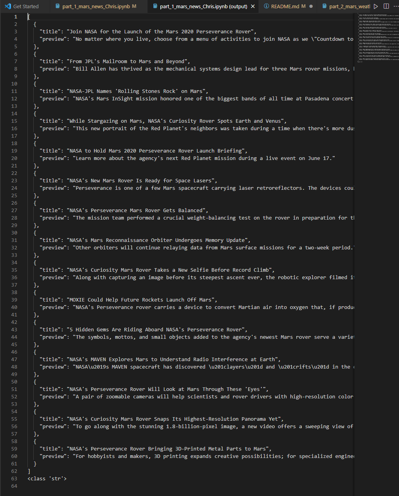
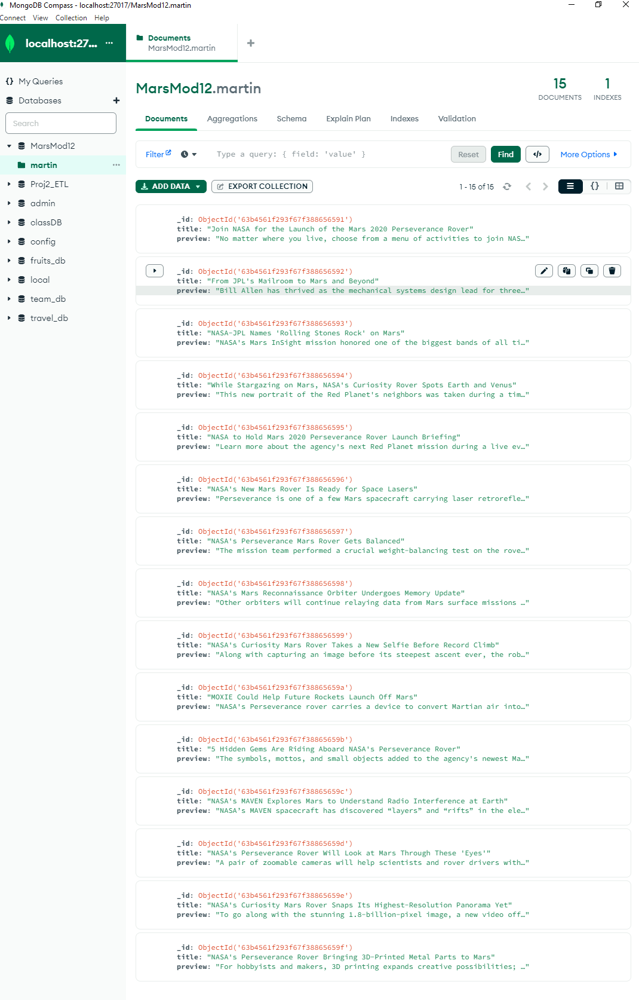

#   **Module 12 Web Scraping Challenge**  
### Chris Gruenhagen 27Dec2022
## **Homework Log**

The Module 12 Challenge homework is located in the BeautifulSoup-challenge repository.  

Mars News (Deliverable 1) consists of:
* jupyter notebook "part_1_mars_news.ipynb",
* json file "marsjson.json" -- screenshot provided as "MarsArticles_JSON.png",
* MongoDB "MarsMod12" -- screenshot provided as "MarsArticles_MongoDB.png" 

Mars Weather (Deliverable 2) consists of:
* jupyter notebook "part_2_mars_weather.ipynb",
* csv file "MarsWeather.csv"

---
## **Purpose**

The purpose of this homework was to:
1. Scrape the titles and preview text from Mars news articles from the 
<a href = "https://redplanetscience.com/" target = "_blank"> Red Planet Science </a> website and store the data in a JSON file and a MongoDB database.
2. Scrape and analyze Mars weather data from an html table on the 
<a href = "https://data-class-mars-challenge.s3.amazonaws.com/Mars/index.html" target = "_blank"> Mars Data Table </a> page.

## **Attribution**
‘Mars news articles provided by’
https://redplanetscience.com/

‘Mars temperature data provided by’
https://data-class-mars-challenge.s3.amazonaws.com/Mars/index.html

## **Deliverables**
### *Deliverable 1:  Scrape Titles and Preview Text from Mars News (40 pts)*

Automated browsing with Splinter was used to visit the Mars news site and the HTML code was extracted with Beautiful Soup. The article titles and preview text were scraped, extracted and stored in a list of dictionaries. The data was then saved in both JSON and MongoDB formats.

Mars News data - JSON format 

Mars News data - screenshot of MongoDB

---
### *Deliverable 2: Scrape and Analyze Mars Weather Data (60 pts)*

Automated browsing with Splinter was used to access the Mars Temperature data.  Beautiful Soup was used to extract the data from the HTML table. The data was stored in a Pandas DataFrame and saved in csv format. The data was analyzed to answer questions about Martian temperature, pressure and the Martian calendar.    

#### *Data Analysis*

1. How many months exist on Mars?

    There are 12 months on Mars.

2. How many Martian (and not Earth) days worth of data exist in the scraped dataset?

    There are 1867 Martian days' worth of data. 

3. What are the coldest and the warmest months on Mars (at the location of Curiosity)?

    
        The coldest month is 3 with an average temperature of -83.31 degrees Celsius.
        The warmest month is 8 with an average temperature of -68.38 degrees Celsius.
          
4. Which months have the lowest and the highest atmospheric pressure on Mars?
 

    
        The month with the lowest average atmospheric pressure is 6 with an average pressure of 745.05.
        The month with the highest average atmospheric pressure is 9 with an average pressure of 913.31.
 
5. About how many terrestrial (Earth) days exist in a Martian year?
 Estimate using the temperature cycle.  Visually estimate the distance from peak to peak.  
 
        The distance from peak to peak is roughly 1475-800, or 675 days. A year on Mars appears to be about 675 days from the plot. 

 Evaluate using the solar longitude (ls) cycle.  The solar longitude cycles from 0 to 359 in one Martian year.

        The first terrestrial_date of Curiosity's first full year on Mars is 2013-08-01.
        The last terrestrial_date of Curiosity's first full year on Mars is 2015-06-18.
        Total number of terrestrial days in a Martian year is 687 days.
 
**Note:**  Internet search confirms that a Mars year is equivalent to 687 Earth days.   
 <a href = "https://mars.nasa.gov/resources/21392/mars-in-a-minute-how-long-is-a-year-on-mars/#:~:text=The%20Earth%20zips%20around%20the,days%20%2D%20or%20one%20Mars%20year.">How Long is a Year on Mars?</a>
 
---

# &#x1F469;&#x200D;&#x1F680; &#x1F680; &#x1f311; &#x1F47D; &#x1F6F8; &#x1F30E; &#x1F6F8; &#x1F47D; &#x1f311;&#x1F680; &#x1F469;&#x200D;&#x1F680;
     emoji & format references:
        https://emojipedia.org
        https://www.markdownguide.org/basic-syntax/

***See below for original homework instructions***
#  Module 12 Web Scraping Challenge 
Due Jan 4, 2023 by 11:59pm 

Points 100 

Submitting a text entry box or a website url
_________________________________________________________
##  **Background**  

You’re now ready to take on the full web-scraping and data analysis project for the mission to Mars. You’ve learned to identify HTML elements on a page, identify their id and class attributes, and use this knowledge to extract information via both automated browsing with Splinter and HTML parsing with Beautiful Soup. You’ve also learned to scrape various types of information. These include HTML tables and recurring elements, like multiple news articles on a webpage.

As you work on this Challenge, remember that you’re strengthening the same core skills that you’ve been developing until now: collecting data, organizing and storing data, analyzing data, and then visually communicating your insights.

##   **What You're Creating** 

This new assignment consists of two technical products. You will submit the following deliverables:

* Deliverable 1: Scrape titles and preview text from Mars news articles. Optionally export the data into a JSON file or a MongoDB database.

* Deliverable 2: Scrape and analyze Mars weather data, which exists in a table.

##   **Files** 

Download the following files to help you get started:

Module 12 Challenge files

https://static.bc-edx.com/data/dl-1-1/m12/lms/starter/Starter_Code.zip

##    **Instructions** 

### ***Deliverable 1: Scrape Titles and Preview Text from Mars News***

Open the Jupyter Notebook in the starter code folder named part_1_mars_news.ipynb. You will work in this code as you follow the steps below to scrape the Mars News website.

1. Use automated browsing to visit the Mars NASA news site Links to an external site.. Inspect the page to identify which elements to scrape.

    HINT: To identify which elements to scrape, you might want to inspect the page by using Chrome Dev Tools.
2. Create a Beautiful Soup object and use it to extract text elements from the website.

3. Extract the titles and preview text of the news articles that you scraped. Store the scraping results in Python data structures as follows:

    * Store each title-and-preview pair in a Python dictionary. And, give each dictionary two keys: title and preview. An example is the following:

        {'title': "Mars Rover Begins Mission!",
      'preview': "NASA's Mars Rover begins a multiyear mission to collect data about the little-explored planet."}
    * Store all the dictionaries in a Python list.

    * Print the list in your notebook.

4. Optionally, store the scraped data in a file or database (to ease sharing the data with others). To do so, export the scraped data to either a JSON file or a MongoDB database.

### ***Deliverable 2: Scrape and Analyze Mars Weather Data***

Open the Jupyter Notebook in the starter code folder named part_2_mars_weather.ipynb. You will work in this code as you follow the steps below to scrape and analyze Mars weather data.

1. Use automated browsing to visit the Mars Temperature Data Site Links to an external site.. Inspect the page to identify which elements to scrape. Note that the URL is https://data-class-mars-challenge.s3.amazonaws.com/Mars/index.html.

    HINT: To identify which elements to scrape, you might want to inspect the page by using Chrome DevTools to discover whether the table contains usable classes.

2. Create a Beautiful Soup object and use it to scrape the data in the HTML table. Note that this can also be achieved by using the Pandas read_html function. However, use Beautiful Soup here to continue sharpening your web scraping skills.

3. Assemble the scraped data into a Pandas DataFrame. The columns should have the same headings as the table on the website. Here’s an explanation of the column headings:

    * id: the identification number of a single transmission from the Curiosity rover
    * terrestrial_date: the date on Earth
    * sol: the number of elapsed sols (Martian days) since Curiosity landed on Mars
    * ls: the solar longitude
    * month: the Martian month
    * min_temp: the minimum temperature, in Celsius, of a single Martian day (sol)
    * pressure: The atmospheric pressure at Curiosity's location

4. Examine the data types that are currently associated with each column. If necessary, cast (or convert) the data to the appropriate datetime, int, or float data types.

5. Analyze your dataset by using Pandas functions to answer the following questions:
    1. How many months exist on Mars?
    2. How many Martian (and not Earth) days worth of data exist in the scraped dataset?
    3. What are the coldest and the warmest months on Mars (at the location of Curiosity)? To answer this question:
        * Find the average the minimum daily temperature for all of the months.
        * Plot the results as a bar chart.
    4. Which months have the lowest and the highest atmospheric pressure on Mars? To answer this question:
        * Find the average the daily atmospheric pressure of all the months.
        * Plot the results as a bar chart.
    5. About how many terrestrial (Earth) days exist in a Martian year? To answer this question:
        * Consider how many days elapse on Earth in the time that Mars circles the Sun once.
        * Visually estimate the result by plotting the daily minimum temperature.
6. Export the DataFrame to a CSV file.

##   **Requirements** 
### ***Deliverable 1: Scrape Titles and Preview Text from Mars News (40 points)***
* Automated browsing (with Splinter) was used to visit the Mars news site, and the HTML code was extracted (with Beautiful Soup) (10 points)

* The titles and preview text of the news articles were scraped and extracted (20 points)

* The scraped information was stored in the specified Python data structure—specifically, a list of dictionaries (10 points)

### ***Deliverable 2: Scrape and Analyze Mars Weather Data (60 points)***
* The HTML table was extracted into a Pandas DataFrame. Splinter and Beautiful Soup were used to scrape the data. The columns have the correct headings and data types (15 points)

* The data was analyzed to answer all five listed questions, with data visualizations provided when specified (40 points)

* The DataFrame was exported into a CSV file (5 points)

##  **References**  

© 2020 - 2022 Trilogy Education Services, a 2U, Inc. brand. All Rights Reserved.